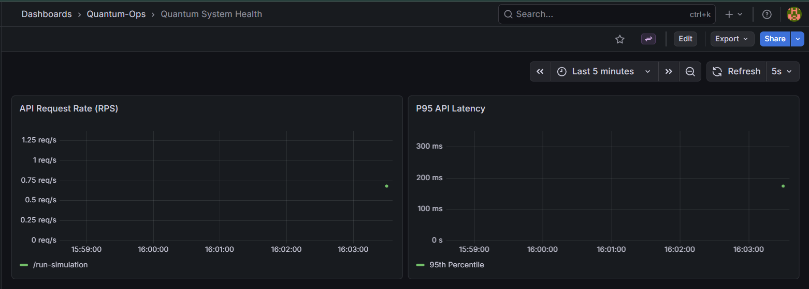
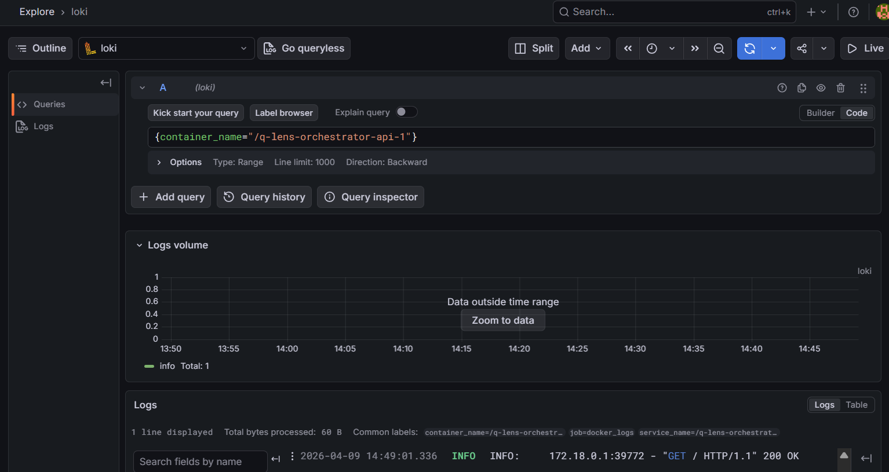
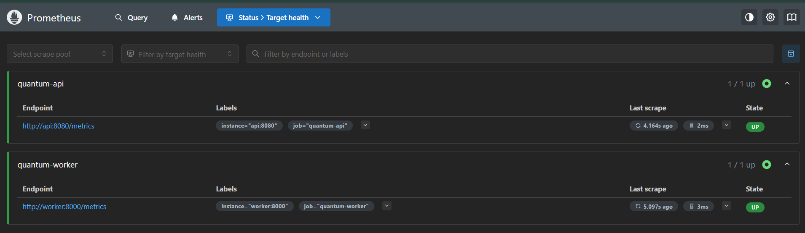

# Q-Lens Orchestrator 🌌

A scalable, asynchronous quantum simulation gateway designed to bridge high-level API requests with intensive back-end quantum computations.

## 🚀 Features
- **FastAPI Gateway**: High-concurrency entry point for simulation requests.
- **Asynchronous Processing**: Celery & Redis task queue to handle RAM-heavy quantum workloads without blocking the API.
- **Observability Stack**: Integrated Grafana, Loki, and Prometheus for real-time log aggregation and metric monitoring.
- **Production-Ready K8s**: Automated CI/CD pipeline targeting Minikube/Kubernetes with full rollout verification.

---

## 🛠️ Architecture

1. **API Gateway**: Receives `POST /run-simulation?qubits=n`.
2. **Message Broker**: Redis queues the simulation task.
3. **Worker Node**: Celery worker executes the quantum logic (IBM Qiskit ready).
4. **Monitoring**: Grafana Agent tails container logs, filters out health-check noise, and pushes to Loki.

---

## 🚦 Getting Started

### Prerequisites
- Docker & Docker Compose
- Minikube (for Kubernetes deployment)
- Python 3.11+

### Local Development (Docker Compose)
1. **Start the stack**:
   ```bash
   docker-compose up -d
   ```
   
2. **Access Services**:
   * **API:** `http://localhost:8000`
   * **Grafana:** `http://localhost:3000` (Logs and Metrics)
   * **Loki:** `http://localhost:3100`
   * **Prometheus:** `http://localhost:9000`
   
### Kubernetes Deployment (Minikube)
The project includes automated manifests in `/argo-templates`
```bash
minikube start
kubectl apply -f argo-templates/
```

---

## 🧪 Testing & CI/CD

### Stress Testing

Verify the system's ability to handle concurrent simulations:
```bash
python tests/stress_test.py
```

### CI/CD Pipeline

The included `.github/workflows/ci-cd.yaml` performs:
1. **Unit Testing:** Pytest with mocked Celery backends.
2. **Containerization:** Internal Minikube builds.
3. **Infrastructure Setup:** Redis & Secret provisioning.
4. **Smoke Testing:** Automated port-forwarding and traffic simulation.

---

## 📊 Monitoring & Observability

The project features a full-tier monitoring stack to ensure the health of quantum simulations.

### 1. Metrics (Prometheus)
- **Infrastructure Tracking**: Monitors CPU/Memory usage of the API and Worker pods.
- **Custom Metrics**: Tracks simulation queue depth and execution latency.
- **Access**: `http://localhost:9090`

### 2. Log Aggregation (Loki)
- **Centralized Logs**: Aggregates logs from all distributed containers into a single searchable interface.
- **Smart Filtering**: The Grafana Agent automatically strips noise (like `/metrics` health checks) to ensure high-signal logs.

### 3. Visualization (Grafana)
- **Dashboards**: Prometheus metrics for API request rate and latency.
- **Access**: `http://localhost:3000` (Default login: `admin` / `${GRAFANA_ADMIN_PASSWORD}`)

---

## 🖼️ Screenshots

### Monitoring Overview

*A view showing simulation success rates and latency (Prometheus).*

### Log Exploration

*Filtered API logs showing clean traffic without background monitoring chatter.*

### Prometheus Targets

*The API and Worker endpoints status tracked by Prometheus.*